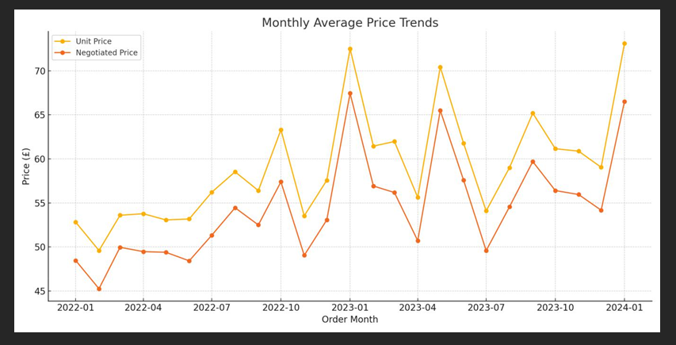

# Procurement-KPI-Analysis

# 📦 Procurement KPI Analysis  
**Author:** Eze Chukwunonso  
**Tools:** Python · pandas · matplotlib · seaborn   

---

## 📋 Overview

This project analyzes procurement data to support better sourcing and supplier strategies. It focuses on:

1. **Supplier risk profiling** based on defect rates and delivery delays  
2. **Cost optimization** through negotiation analysis  
3. **Price trend forecasting** to improve contract timing decisions

---

## 📁 Project Files

| File | Description |
|------|-------------|
| `Analysis.py` | Python script used for cleaning and analysis |
| `Procurement KPI Analysis Dataset.csv` | Raw procurement dataset |
| `Final_Procurement_Report_With_Charts_Eze_Chukwunonso.pdf` | Full PDF report |
| `visuals/` | Folder containing all generated charts |

---

## 📊 Key Insights

- Over £4 million in procurement savings achieved  
- Top supplier, `Beta_Supplies`, delivered 8.2% in negotiated savings  
- Prices spike seasonally in **January** across multiple years  
- Defect rates above 10% found in several suppliers

---

## 📸 Visual Highlights

### Top 10 Suppliers by Percentage Savings  

### Top 10 Suppliers by Total Cost Savings  

### Monthly Average Price Trends  

---

## 📌 Strategic Recommendations

- Lock-in contracts in **Q3** to avoid Q1 inflation  
- Use **supplier scorecards** to monitor KPIs  
- Focus spend with high-performing vendors  
- Set savings benchmarks at ~7.5% per PO

---

## 🧠 Skills Demonstrated

- Procurement KPI analysis  
- Data cleaning and transformation  
- Supplier performance evaluation  
- Cost optimization modeling  
- Visualization and report generation

